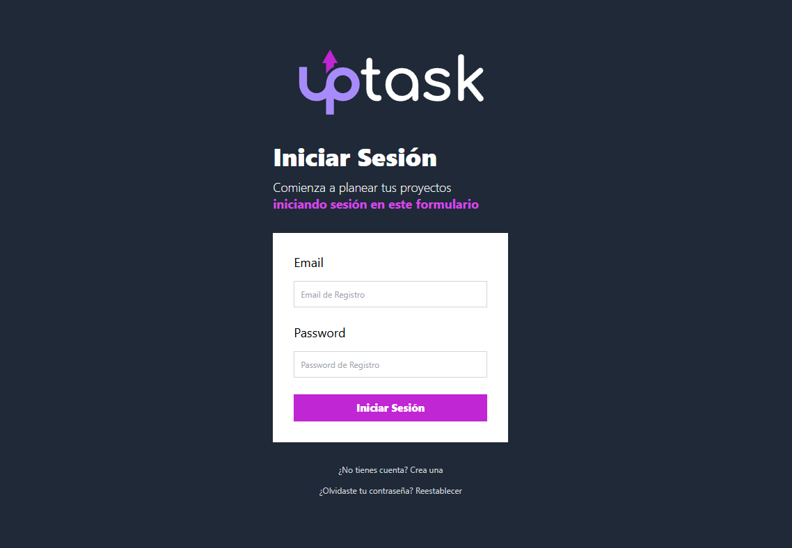

<!-- Banner -->


# 👋 ¡Hola, gracias por visitar mi Proyecto!

## 🚀 Proyecto: UpTask - Administrador de Tareas

Este es el frontend de **UpTask**, una aplicación web full stack tipo *Task Manager* donde cada usuario puede gestionar sus proyectos, tareas y colaborar con otros usuarios. Desarrollado con el stack MERN, este frontend fue creado utilizando **React con TypeScript**, y una serie de herramientas modernas para garantizar rendimiento, escalabilidad y una experiencia de usuario fluida.

## 🛠️ Tecnologías Utilizadas

- **React + TypeScript**: Para construir interfaces modernas y robustas.
- **Tailwind CSS**: Para una interfaz estilizada y responsiva.
- **React Router DOM**: Navegación entre páginas del proyecto.
- **React Query**: Manejo eficiente de datos y sincronización con la API.
- **Zod**: Validación de esquemas para garantizar respuestas consistentes desde la API.
- **react-hook-form**: Para formularios accesibles y con gran rendimiento.
- **react-toastify**: Notificaciones rápidas y agradables para el usuario.

## 🔐 Autenticación y Autorización

- Registro y login de usuarios con validación.
- Recuperación de contraseña.
- Acceso a diferentes vistas según el rol: propietario o colaborador.
- Protección de rutas y gestión de tokens.

## 📝 Funcionalidades Principales

- **Dashboard Personalizado**: Al iniciar sesión, el usuario ve sus proyectos y aquellos en los que colabora.
- **Gestión de Proyectos**: Crear, editar y eliminar proyectos propios.
- **Tareas por Proyecto**: Cada proyecto tiene sus tareas, con posibilidad de agregarlas, editarlas, marcarlas como completas/incompletas y eliminarlas.
- **Notas Adicionales**: Anexar notas a las tareas para mayor contexto.
- **Colaboración en Tiempo Real**: Agrega colaboradores a tus proyectos para trabajar en conjunto.
- **Validación en Frontend**: Uso de Zod y react-hook-form para mantener la integridad de los datos desde el formulario.

## 📂 Estructura del Proyecto

```bash
src/
├── api/              # Métodos para interactuar con la API (peticiones HTTP)
├── components/       # Componentes reutilizables como formularios, listas, modales
├── hooks/            # Custom hooks (useAuth, useProjects, etc.)
├── img/              # Imágenes utilizadas en la aplicación
├── layouts/          # Layouts generales (por ejemplo, DashboardLayout)
├── lib/              # Configuración de librerías como Axios
├── pages/            # Vistas principales para cada ruta
├── types/            # Tipos de datos definidos con TypeScript
└── utils/            # Funciones auxiliares (formateo de fecha, validaciones, etc.)
```

## 🚀 Cómo Empezar
1. Clona el repositorio:

```bash
git clone https://github.com/RodrigoLoboDev/UpTask_FrontEnd
```
2. Instala las dependencias:

```bash
npm install
```

3. Inicia el servidor de desarrollo:

```bash
npm run dev
```

## 🎥 Demostración
👉 Próximamente un video demo del proyecto.

## 🌐 Prueba la Aplicación
👉 https://uptask-rodrigodev.vercel.app/

## 📸 Capturas de Pantalla


## 🤝 Contribuciones
Las contribuciones son bienvenidas. Si tienes ideas para mejorar el proyecto, no dudes en abrir un issue o hacer un pull request.

## 📧 Contacto
- Email: rolobo2812@gmail.com
- LinkedIn: [Jesús Luis Rodrigo Lobo](https://www.linkedin.com/in/jes%C3%BAs-luis-rodrigo-lobo-6594a81b4/)
- GitHub: [RodrigoLoboDev](https://github.com/RodrigoLoboDev)

#### ⭐️ Si te gusta lo que hago, no dudes en seguirme y contribuir a mis proyectos. ⭐️